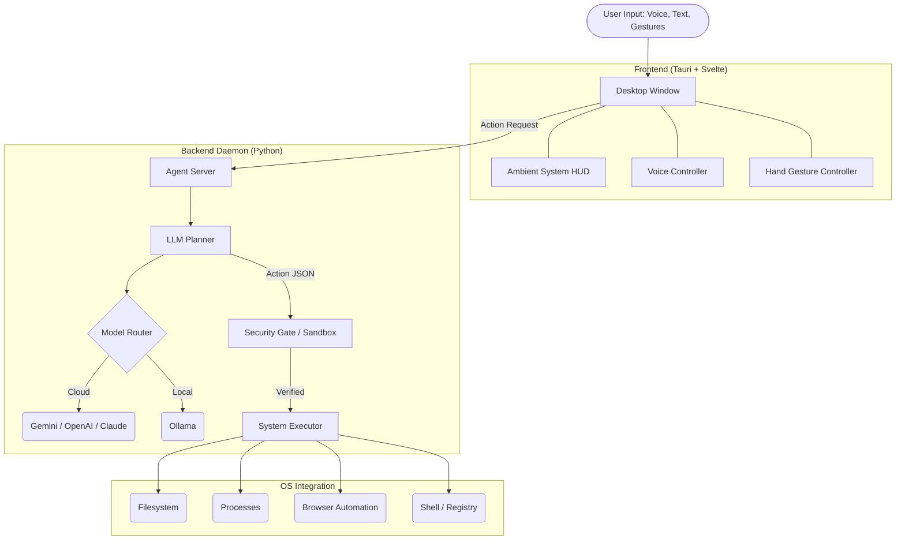

# Cortex-OS — AI System Control Agent

<p align="center">
  <a href="https://github.com/VyomKulshrestha/Cortex-OS/releases"></a>
  <a href="https://github.com/VyomKulshrestha/Cortex-OS/releases"></a>
  <a href="https://github.com/VyomKulshrestha/Cortex-OS/actions/workflows/release.yml"></a>
  <a href="https://github.com/VyomKulshrestha/Cortex-OS/actions/workflows/ci.yml"></a>
  <a href="https://github.com/VyomKulshrestha/Cortex-OS/issues?q=is%3Aissue+is%3Aopen+label%3A%22good+first+issue%22"></a>
  <a href="LICENSE"></a>
  
</p>

<p align="center">
  <!-- Replace with your actual demo GIF path once recorded -->
  
</p>


<p align="center">
  <strong>Control your entire computer with natural language, voice, and hand gestures.</strong><br>
  An open-source, privacy-first AI agent that plans, executes, and verifies complex multi-step tasks.
</p>

<p align="center">
  <a href="#quick-start">Quick Start</a> •
  <a href="#-jarvis-mode-new">JARVIS Mode</a> •
  <a href="#features">Features</a> •
  <a href="#architecture">Architecture</a> •
  <a href="#security">Security</a> •
  <a href="CONTRIBUTING.md">Contributing</a>
</p>

---

## Why Cortex-OS?

Unlike simple command runners, Cortex-OS is a **true agentic system** with a Plan → Execute → Verify → Retry pipeline:

1. **Planner** — LLM converts your natural language into a structured multi-step action plan
2. **Executor** — Each action is dispatched to native OS APIs (never GUI automation)
3. **Verifier** — Post-execution verification confirms the action succeeded
4. **Auto-Fix** — If generated code fails, the LLM automatically fixes and retries it
5. **Security** — Five-tier permission system with confirmation gates and rollback support

## 🤖 JARVIS Mode (New!)

Cortex-OS now includes a futuristic, Iron Man-style interface:

- 🎤 **Voice Control**: Push-to-talk or use the always-on **"Hey Cortex"** wake word.
- 🗣️ **Text-to-Speech**: Cortex-OS speaks its responses aloud to you.
- 🤚 **12 Hand Gestures**: Control your PC via webcam using gestures (Open Palm, Thumbs Up/Down, Peace, Fist, Point, Rock, OK, Swipe, Finger Gun, Call Me).
- 🖊️ **Air Drawing**: Point your index finger to draw glowing trails in the air.
- 🌀 **Arc Reactor UI**: Animated spinning reactor logo, neural background, and particle explosion effects on task completion.
- 📊 **Ambient HUD**: Holographic system monitor overlay for CPU, RAM, and Disk metrics.

## 🧪 Tested With 10 Complex Tasks — 80%+ Pass Rate

| Task | Type | Status |
|------|------|--------|
| Web scrape Wikipedia + word frequency analysis | Web + Code | ✅ |
| Background CPU trigger with voice alert | System Monitor | ✅ |
| Screenshot OCR + text reversal + file tree | Vision + Code | ✅ |
| Multi-page web comparison (Python vs JS) | Web + Analysis | ✅ |
| Create project scaffold + run unit tests | File + Code | ✅ |
| REST API fetch + JSON parse + formatted table | API + Code | ✅ |
| CSV data pipeline + financial analysis | Data + Code | ✅ |
| And more... | | ✅ |

## 🖥️ Cross-Platform Support

| Platform | Status |
|----------|--------|
| Windows 10/11 | ✅ Full support |
| Ubuntu / Debian | ✅ Full support |
| macOS | ✅ Full support |
| Fedora / Arch | ✅ Via dnf/pacman |

## ⚡ 50+ Action Types

### File Operations
`file_read` · `file_write` · `file_delete` · `file_move` · `file_copy` · `file_list` · `file_search` · `file_permissions`

### Process Management
`process_list` · `process_kill` · `process_info`

### Shell Execution
`shell_command` · `shell_script` (multi-line bash/powershell/python)

### Code Execution
`code_execute` — Run Python, PowerShell, Bash, or JavaScript with auto-fix on failure

### Browser & Web
`browser_navigate` · `browser_extract` · `browser_extract_table` · `browser_extract_links`

### Screen & Vision
`screenshot` · `screen_ocr` · `screen_analyze`

### Package Management
`package_install` · `package_remove` · `package_update` · `package_search`
Auto-detects: winget, choco, brew, apt, dnf, pacman

### System Information
`system_info` · `cpu_usage` · `memory_usage` · `disk_usage` · `network_info` · `battery_info`

### Window Management
`window_list` · `window_focus` · `window_close` · `window_minimize` · `window_maximize`

### Audio / Volume
`volume_get` · `volume_set` · `volume_mute`

### Display / Screen
`brightness_get` · `brightness_set` · `screenshot`

### Power Management
`power_shutdown` · `power_restart` · `power_sleep` · `power_lock` · `power_logout`

### Network / WiFi
`wifi_list` · `wifi_connect` · `wifi_disconnect`

### Clipboard
`clipboard_read` · `clipboard_write`

### Scheduled Tasks & Triggers
`schedule_create` · `schedule_list` · `schedule_delete` · `trigger_create`

### Environment Variables
`env_get` · `env_set` · `env_list`

### Downloads
`download_file`

### Service Management (Linux)
`service_start` · `service_stop` · `service_restart` · `service_enable` · `service_disable` · `service_status`

### GNOME / Desktop (Linux)
`gnome_setting_read` · `gnome_setting_write` · `dbus_call`

### Windows Registry
`registry_read` · `registry_write`

### Open / Launch / Notify
`open_url` · `open_application` · `notify`

## Architecture



## 🚀 Installation

### Option 1: Download Compiled Desktop App (Recommended)

The easiest way to get started is to download the pre-compiled installer for your operating system.

1. Go to the [GitHub Releases page](https://github.com/VyomKulshrestha/Cortex-OS/releases).
2. Download the installer for your OS:
   - **Windows**: `Cortex-OS_x64-setup.exe`
   - **macOS (Apple Silicon)**: `Cortex-OS_aarch64.dmg`
   - **macOS (Intel)**: `Cortex-OS_x86_64.dmg`
   - **Linux**: `.AppImage` or `.deb`
3. Install the app.
4. Open Cortex-OS and enter your API Key (e.g., Gemini, OpenAI, Claude) in the Settings tab.

*Note: The Python backend requires Python 3.11+ installed on your system. You must start the local daemon manually for now.*

### Option 2: Build from Source (For Developers)

If you want to contribute or modify Cortex-OS, build it from the source code:

**1. Install the Python daemon:**
```bash
git clone https://github.com/VyomKulshrestha/Cortex-OS.git
cd Cortex-OS/daemon
pip install -e ".[full,dev]"
```

**2. Choose your LLM:**
*   Local (Ollama): `ollama pull llama3.1:8b` -> `ollama serve`
*   Cloud (Gemini/OpenAI/Claude): Add your API key in the app GUI.

**3. Run the daemon:**
```bash
cd daemon
python -m pilot.server
```

**4. Run the frontend:**
```bash
cd tauri-app/ui
npm install
npm run dev
```

## Example Commands

```
"Show me my system info"
"Take a screenshot and read the text on screen"
"Go to Wikipedia's page on AI and summarize the first 3 paragraphs"
"Create a Python project with tests and run them"
"Kill the process using the most CPU"
"Monitor my CPU and alert me when it goes above 80%"
"Download a file and show me a tree of the folder"
"List all .py files on my Desktop"
"Set my volume to 50%"
"Create a CSV with sales data and analyze it"
"What's my IP address?"
"Install Firefox"
```

## 🛡️ Security

> [!WARNING]
> **PLEASE READ BEFORE USE: SYSTEM COMPROMISE RISK**
> Cortex-OS is an autonomous agent with the ability to execute code, delete files, and run terminal commands directly on your host operating system. While we have provided sandbox measures, the AI has real system access. **Do NOT run Cortex-OS with root/Administrator privileges** unless absolutely necessary. We are not responsible for accidental data loss caused by LLM hallucinations.

- All AI outputs pass through structured schema validation before execution
- Five-tier permission system (read-only through root-level)
- Confirmation required for system-modifying and destructive actions
- Snapshot-based rollback via Btrfs or Timeshift (Linux)
- Append-only audit log for all executed actions
- Command whitelist with optional unrestricted mode
- **Encrypted API key storage** via platform keyring (GNOME Keyring / Windows Credential Manager)
- API keys are NEVER logged, included in plans, or sent to local LLMs

### Permission Tiers

| Tier | Level | Auto-Execute | Examples |
|------|-------|-------------|----------|
| 0 - Read Only | 🟢 | Yes | file_read, system_info, clipboard_read |
| 1 - User Write | 🟡 | Yes | file_write, clipboard_write, env_set |
| 2 - System Modify | 🟠 | Needs Confirm | package_install, service_restart, wifi_connect |
| 3 - Destructive | 🔴 | Needs Confirm | file_delete, process_kill, power_shutdown |
| 4 - Root Critical | ⛔ | Needs Confirm | root operations, disk operations |

## Configuration

Config file: `~/.config/pilot/config.toml`

```toml
[model]
provider = "ollama"           # "ollama" | "cloud"
ollama_model = "llama3.1:8b"
cloud_provider = "gemini"     # "gemini" | "openai" | "claude"

[security]
root_enabled = false
confirm_tier2 = true
unrestricted_shell = false
snapshot_on_destructive = true

[server]
host = "127.0.0.1"
port = 8785
```

## 🤝 Contributing

We love contributions! Whether it's adding a new gesture, fixing a bug, or building a new plugin, check out our guides to get started.

1. Read our [Contributing Guide](CONTRIBUTING.md) to set up your dev environment.
2. Check the [Good First Issues](https://github.com/VyomKulshrestha/Cortex-OS/issues?q=is%3Aissue+is%3Aopen+label%3A%22good+first+issue%22) tab on GitHub to find beginner-friendly tasks.
3. Review our [Code of Conduct](CODE_OF_CONDUCT.md).
4. Join the community discussions in [GitHub Discussions](https://github.com/VyomKulshrestha/Cortex-OS/discussions).

## License

MIT
